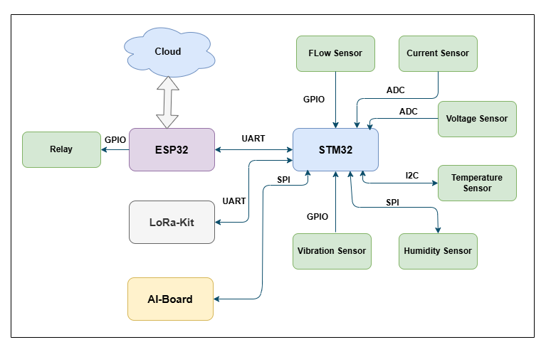
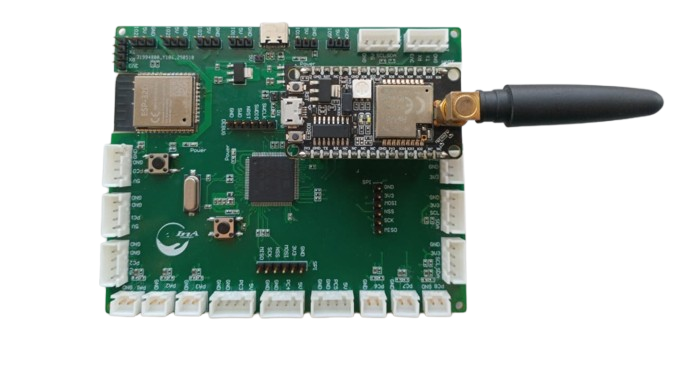

# Electrical Automation Engineer

#### Technical Skills: Altium Designer, Saturn PCB Toolkit, ISIS proteus, JTAG/SWD, VS Code, PlatformIO, STM32CubeIDE

## Education
- **National Engineering School of Gabes (ENIG)**, Electrical and Automation Engineering  
  *September 2022 - June 2025*
- **Preparatory Institute for Engineering Studies (IPEI Gabes)**, Preparatory Cycle  
  *September 2019 - June 2022*
- **Sombat High School**, Science Technology Baccalaureate  
  *June 2019*
  
## Experience
**4InA Technologie, Manouba** | End-of-Year Internship  
*February 2025 - June 2025*  
  - Designed a 4-layer PCB integrating STM32 and ESP32 microcontrollers for a modular smart meter.  
  - Developed embedded firmware for data transmission and remote control via an HTTP server.  
  - Delivered a functional prototype for industrial use.  
  - *Keywords*: Embedded Hardware, 4-layer PCB, DFM, Altium Designer, Smart Meters

  **WEMAKE 3D, Ariana** | Summer Internship  
  *June 2024 - July 2024*  
  - Developed a Human-Machine Interface for an automatic cutting device.  
  - Designed a PCB to interface sensors and motor controls.  
  - *Keywords*: HMI, PCB Design, ESP32, Git, 3D Printers

  **STEG-BTGG, Gabès** | Summer Internship  
  *July 2023*  
  - Observed gas compression and pipeline systems, gaining insight into industrial energy infrastructure.  
  - *Keywords*: Gas Compression, Pipeline Management, Energy Infrastructure

## Projects
## Modular Motherboard for Smart Meters

**Technologies:** STM32, ESP32, LoRa, UART, I2C, SPI, ADC, Altium Designer, Saturn PCB Toolkit, Power Management

### Overview  
Designed and developed a modular **4-layer** PCB for smart metering applications, integrating sensor acquisition, signal processing, and wireless communication. The board supports:
- **Current and voltage sensors** for real-time energy monitoring  
- Interfaces for **external sensors** such as temperature, vibration, and pressure (via I2C/SPI)  
- **ESP32 module** for wireless control, receiving data via UART from the STM32 core  
- **LoRa kit** for long-range data transmission  
- Onboard power regulation (LDO and switching regulators)  
- Routing optimized with **Saturn PCB Toolkit** for impedance control and trace calculations  
All design files were created using **Altium Designer** with careful layer stackup and EMC considerations.

### System Block Diagram  
A high-level representation of the microcontroller interfaces, sensor inputs, and communication channels.

### PCB Design – Gerber Preview  
A visual snapshot of the routed PCB, highlighting copper traces, component placement, and ground planes.

[View PCB Gerber Preview (PDF)](assets/Job.PDF)

### Assembled PCB  
Final assembled board used for testing and integration with the smart metering system.

.png)

### Demonstration – Flashing and Testing  
Short demonstration of alimentation testing, firmware upload via ST-Link for STM32, and via USB to UART converter for ESP32.

[▶️ Watch PCB Testing Video](assets/vid-20250627-165903_GycJ9RA9.mp4)

## ESP32-S3 Mini Board Design

This is a custom 4-layer development board designed around the **ESP32-S3-MINI-1** module, inspired by the official Espressif DevKitM-1. The board offers enhanced flexibility with **dual USB-C ports**, allowing for both **power supply** and **native USB communication** independently.

### Key Features

- **ESP32-S3-MINI-1** module with dual-core Xtensa® LX7 CPU and AI acceleration  
- **Dual USB-C ports**:
  - One for **native USB** (USB-OTG / USB-JTAG / USB-CDC)
  - One for **power and flashing** via onboard **CH343** USB-UART bridge
- **4-layer PCB** for better signal integrity and noise control
- Onboard 5V to 3.3V **LDO voltage regulator**
- **BOOT** and **RESET** buttons for development and flashing
- Breakout **GPIO headers** for sensor and module integration
- Compact and robust design for embedded and IoT prototyping

### Design Details

- Designed using **Altium Designer**
- **Saturn PCB Toolkit** used for controlled impedance and trace width calculations
- USB differential pair routing optimized for signal quality
- All components selected for reliability, assembly ease, and developer support
### PCB 3D View

