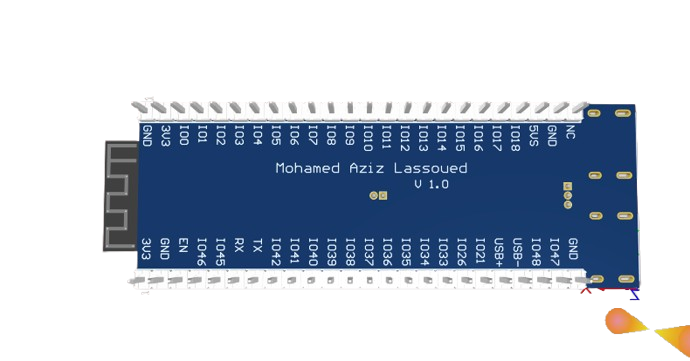
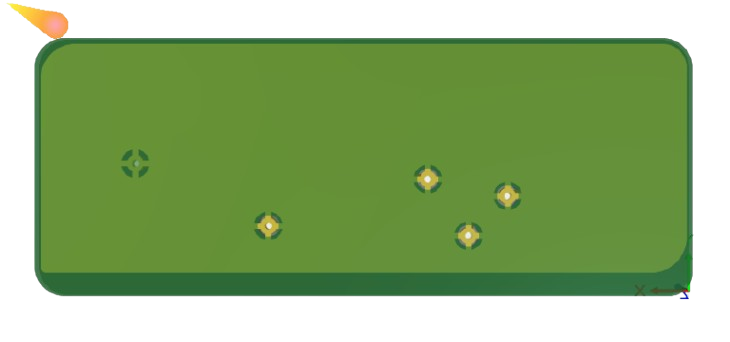

# Electrical Automation Engineer

#### Technical Skills: Altium Designer, Saturn PCB Toolkit, ISIS proteus, JTAG/SWD, VS Code, PlatformIO, STM32CubeIDE

## Education
- **National Engineering School of Gabes (ENIG)**, Electrical and Automation Engineering  
  *September 2022 - June 2025*
- **Preparatory Institute for Engineering Studies (IPEI Gabes)**, Preparatory Cycle  
  *September 2019 - June 2022*
- **Sombat High School**, Science Technology Baccalaureate  
  *June 2019*
  
## Experience
**4InA Technologie, Manouba** | End-of-Year Internship  
*February 2025 - June 2025*  
  - Designed a 4-layer PCB integrating STM32 and ESP32 microcontrollers for a modular smart meter.  
  - Developed embedded firmware for data transmission and remote control via an HTTP server.  
  - Delivered a functional prototype for industrial use.  
  - *Keywords*: Embedded Hardware, 4-layer PCB, DFM, Altium Designer, Smart Meters

  **WEMAKE 3D, Ariana** | Summer Internship  
  *June 2024 - July 2024*  
  - Developed a Human-Machine Interface for an automatic cutting device.  
  - Designed a PCB to interface sensors and motor controls.  
  - *Keywords*: HMI, PCB Design, ESP32, Git, 3D Printers

  **STEG-BTGG, Gabès** | Summer Internship  
  *July 2023*  
  - Observed gas compression and pipeline systems, gaining insight into industrial energy infrastructure.  
  - *Keywords*: Gas Compression, Pipeline Management, Energy Infrastructure

## Projects
## Modular Motherboard for Smart Meters

**Technologies:** STM32, ESP32, LoRa, UART, I2C, SPI, ADC, Altium Designer, Saturn PCB Toolkit, Power Management

### Overview  
Designed and developed a modular **4-layer** PCB for smart metering applications, integrating sensor acquisition, signal processing, and wireless communication. The board supports:
- **Current and voltage sensors** for real-time energy monitoring  
- Interfaces for **external sensors** such as temperature, vibration, and pressure (via I2C/SPI)  
- **ESP32 module** for wireless control, receiving data via UART from the STM32 core  
- **LoRa kit** for long-range data transmission  
- Onboard power regulation (LDO and switching regulators)  
- Routing optimized with **Saturn PCB Toolkit** for impedance control and trace calculations  
All design files were created using **Altium Designer** with careful layer stackup and EMC considerations.

### System Block Diagram  
A high-level representation of the microcontroller interfaces, sensor inputs, and communication channels.

### PCB Design – Gerber Preview  
A visual snapshot of the routed PCB, highlighting copper traces, component placement, and ground planes.

[View PCB Gerber Preview (PDF)](assets/Job.PDF)

### Assembled PCB  
Final assembled board used for testing and integration with the smart metering system.

.png)

### Demonstration – Flashing and Testing  
Short demonstration of alimentation testing, firmware upload via ST-Link for STM32, and via USB to UART converter for ESP32.

[▶️ Watch PCB Testing Video](assets/vid-20250627-165903_GycJ9RA9.mp4)

## ESP32-S3 Mini Board Design

This is a custom 4-layer development board designed around the **ESP32-S3-MINI-1** module, inspired by the official Espressif DevKitM-1. The board offers enhanced flexibility with **dual USB-C ports**, allowing for both **power supply** and **native USB communication** independently.

### Key Features

- **ESP32-S3-MINI-1** module with dual-core Xtensa® LX7 CPU and AI acceleration  
- **Dual USB-C ports**:
  - One for **native USB** (USB-OTG / USB-JTAG / USB-CDC)
  - One for **power and flashing** via onboard **CH343** USB-UART bridge
- **4-layer PCB** for better signal integrity and noise control
- Onboard 5V to 3.3V **LDO voltage regulator**
- **BOOT** and **RESET** buttons for development and flashing
- Breakout **GPIO headers** for sensor and module integration
- Compact and robust design for embedded and IoT prototyping

### Design Details

- Designed using **Altium Designer**
- **Saturn PCB Toolkit** used for controlled impedance and trace width calculations
- USB differential pair routing optimized for signal quality
- All components selected for reliability, assembly ease, and developer support
### PCB 3D View

### Documentation & Downloads
ESP32-S3-MINI-1 Datasheet [Download PDF](assets/esp32-s3-mini-1_mini-1u_datasheet_en.pdf)
Gerber Files  [Download ZIP](assets/Gerber.zip)
### Applications

- Embedded prototyping
- USB-based device development
- IoT systems using ESP-IDF

## Custom PCB to control the Modular Cutter Device

This is a custom-designed PCB developed for a modular ribbon and belt cutter system. It acts as the main controller board, integrating stepper motor control, LCD interface, and regulated power supply, all centered around the **ESP8266** microcontroller.

### Key Features

- **ESP8266** microcontroller for Wi-Fi-based control and automation
- **Dual stepper motor support**:
  - Cutter motor and feeder motor driven via **A4988 stepper drivers**
  - Output headers provided for clean connection to motors
- **RepRap Smart LCD connector**:
  - For user-friendly HMI control with display and encoder
- **Power supply**:
  - **12V input** powering the stepper motors directly
  - **LM7805 regulator** provides 5V output to power the ESP8266 and logic level components
- **Compact single-board design**, suitable for enclosure mounting
- Designed in **Altium Designer**

### PCB 3D View

### Documentation & Downloads

Gerber Files  [Download ZIP](assets/Project Outputs for Modular cutter.zip)

### Applications

- Modular automatic ribbon or wire cutters
- Embedded automation tools
- IoT-controlled electromechanical systems

## All-Terrain Robot PCB

This is a custom-designed PCB for controlling an all-terrain mobile robot. It is based on the **ESP8266** microcontroller and built to interface directly with **BTS7960 motor drivers** for robust DC motor control. The board also features onboard power regulation to support both logic and motor voltage requirements.

### Key Features

- **ESP8266** microcontroller for Wi-Fi-based wireless control
- **Motor Driver Interface**:
  - Dual channel outputs to control two **BTS7960** H-bridge drivers
  - Suitable for driving high-current DC motors
- **Power Supply**:
  - **12V input** used directly for powering DC motors
  - **LM7805 regulator** provides a **stable 5V output** to power the ESP8266
- **Control Interfaces**:
  - Logic-level pins routed to BTS7960 IN/EN/IS pins for PWM and direction control
- **Compact and rugged design**, ideal for mobile robotics platforms
- Designed using **Altium Designer**

### PCB 3D View

### Applications

- All-terrain mobile robots
- Wi-Fi remote-controlled rovers
- Educational robotics platforms

## 3.3V LDO Power Supply Module

This project is a compact and efficient power supply PCB that converts input voltage to a stable **3.3V output** using the **MIC5317-3.3YM5-TR** Low Dropout (LDO) regulator. It’s designed for powering low-power embedded systems, sensors, or wireless modules.

### ⚙️ Key Features

- **MIC5317-3.3YM5-TR** LDO regulator
  - Output: 3.3V up to 500mA
  - Low dropout voltage
  - Ultra-low quiescent current
- **Input Voltage**: 3.6V – 5.5V
- **Output Connector**: 
  - **SM02B-GHS-TB(LF)(SN)** 2-pin JST-type surface mount connector for 3.3V output
- **Compact footprint**: ideal for integration into larger systems or standalone use

### PCB 3D View

### Documentation & Downloads
Gerber Files  [Download ZIP](assets/Project Outputs for LDOconervter.zip)

### Applications

- 3.3V supply for ESP modules, sensors, and logic circuits
- Custom embedded systems
- Prototyping and low-power IoT devices

